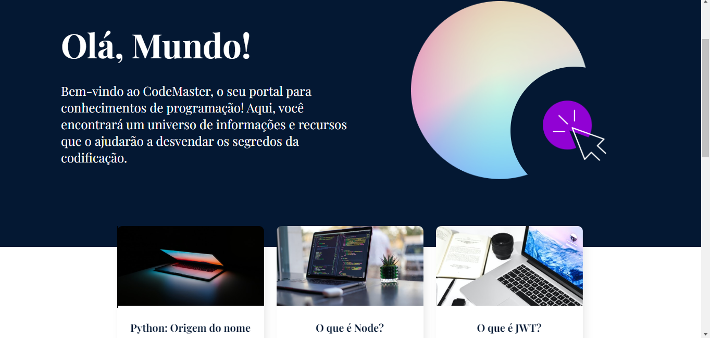
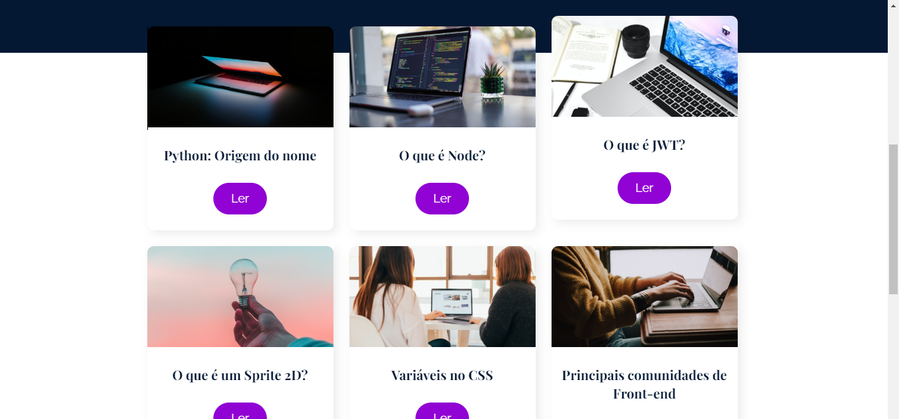

# Projeto CodeMaster

Bem-vindo(a) ao repositório do projeto CodeMaster! Este projeto foi desenvolvido como uma aplicação web usando a biblioteca React, e tem como objetivo fornecer um portal interativo de conhecimentos de programação.

## Descrição

O CodeMaster é um aplicativo web que oferece aos usuários um espaço para explorar e aprender programação de forma personalizada. Com uma interface intuitiva, os usuários podem navegar por artigos abrangentes.

## Recursos Principais

- **Artigos Abrangentes:** O aplicativo apresenta uma vasta coleção de artigos que abrangem conceitos fundamentais e tópicos avançados de diversas linguagens de programação, incluindo Python, Java, C++ e muito mais.

